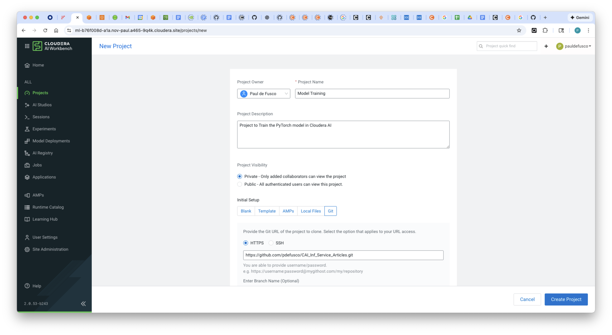
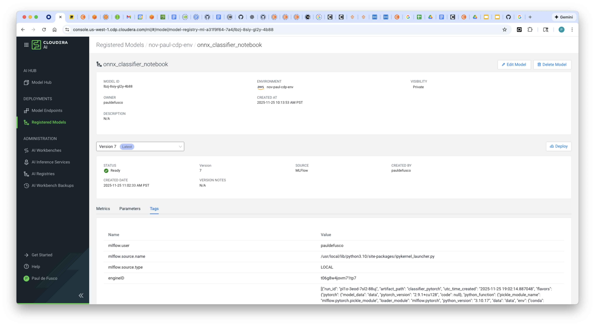
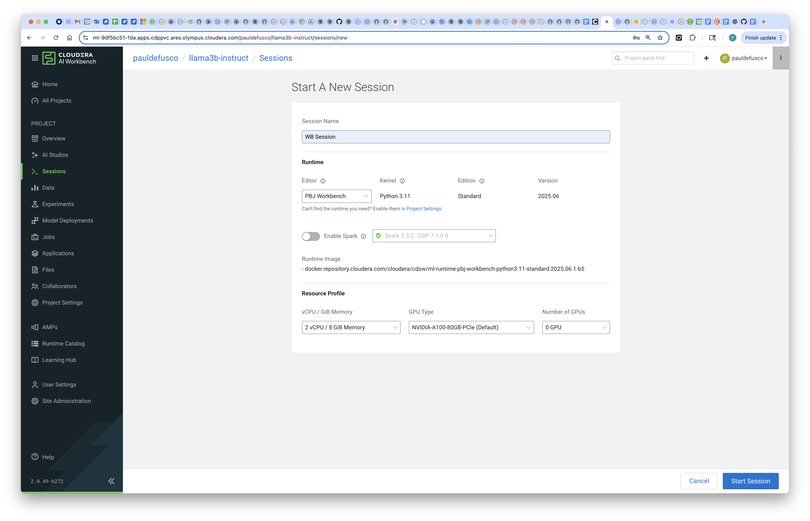
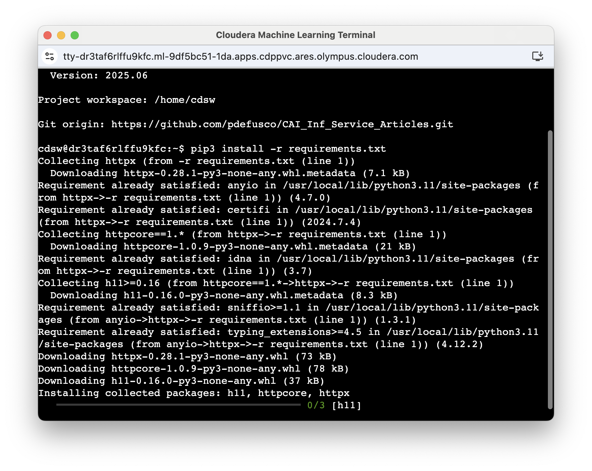
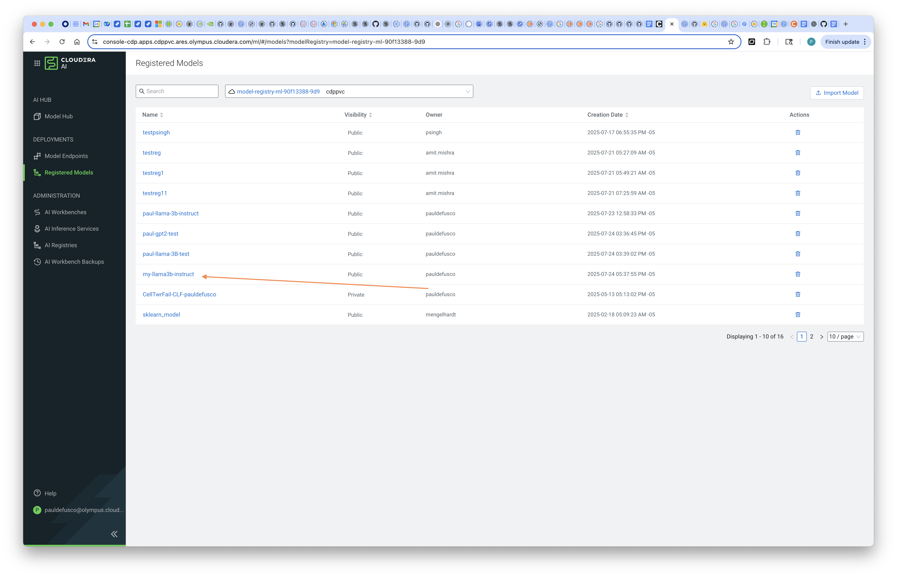

# Hybrid AI: Train a PyTorch Model in Cloudera AI on AWS and Deploy it in Cloudera AI Inference Service OnPrem


## Objective

In this tutorial you will learn how to programmatically train, register, and deploy a model with Cloudera AI Hybrid Cloud. First, you will train a PyTorch model in Cloudera AI on AWS. Then, you will register the model with Cloudera AI on premises. Finally, you will deploy the model to the Cloudera AI Inference Service, also running on premises.

The general purpose of the demo is to show an end to end hybrid AI workflow between Cloudera AI on AWS and on Prem. The same worfklow steps can be applied to other use cases, frameworks, and Cloudera AI on Azure.

### Motivation

Organizations face a tradeoff when deciding where to run GPU workloads: cloud GPUs are easy to provision and ideal for bursty, short-term training needs, but they can be costly over time; on-premises GPU infrastructure, while significantly cheaper at scale, requires procurement cycles, installation effort, and ongoing operational management.

With Cloudera AI Hybrid Cloud, customers don’t have to choose between these options. The platform provides a unified experience across cloud and on-prem environments, enabling teams to train or fine-tune models using ephemeral cloud GPUs and then seamlessly bring those models back on-prem for lower-cost inference.

Because Cloudera delivers the same environment, APIs, and governance everywhere, organizations can integrate both deployment models in a single workflow without re-architecting or rewriting code.

### Cloudera AI

Cloudera AI (CAI) is a platform that enables organizations to build, train, and deploy machine learning and artificial intelligence models at scale. One of its key features is the Cloudera AI Inference Service, which allows users to easily deploy large language models (LLMs) for real-time or batch inference. With Cloudera AI, data scientists and engineers can manage and serve LLMs like Llama, Mistral, or open-source GPT models using containerized environments and scalable infrastructure. This service supports secure, low-latency model serving, making it easier to integrate AI into enterprise applications.

### Hybrid Enterprise AI with CAI

Cloudera AI (CAI) is a core component of Cloudera’s hybrid cloud data platform, which is designed to operate seamlessly across both private and public cloud environments. This hybrid architecture allows organizations to deploy AI models securely wherever their data resides—on-premises for sensitive workloads or in the public cloud for greater scalability and flexibility.

With Cloudera AI, enterprises can maintain governance, compliance, and control over their machine learning pipelines while taking advantage of cloud-native capabilities. This ensures that large language models and other AI applications can be deployed and managed securely across diverse IT environments without compromising performance or data privacy.

## Requirements

This example was built with Cloudera on AWS and Cloudera OnPrem. At time of this writing, all latest component versions were used. In general, previus and/or future component versions will work as well. The component versions used for each environment were:

##### Cloudera on AWS Requirements

* Cloudera On AWS - Runtime 7.3.1
* CAI Workbench 2.0.53
* AI Registry 1.11.0

##### Cloudera on Prem Requirements

* Cloudera On Prem Private Cloud 1.5.5 on ECS - Runtime 7.13.1
* CAI Workbench 2.0.49
* Inference Service 1.4.0
* AI Registry 1.7.0.

##### Additional Requirements

In order to reproduce the example you will need:

* AWS Credentials: AWS_ACCESS_KEY_ID, AWS_SECRET_ACCESS_KEY, and AWS_SESSION_TOKEN.
* Ability to generate CDP Credentials for your user in each environment: CDP_ACCESS_KEY_ID and CDP_PRIVATE_KEY.
* Ranger and IDBroker Mapping configurations for User and AI Registries in each environment.

### Step by Step Tutorial

All artifacts are included in this Git repository under the ```hybrid-ai``` folder. You can clone or fork it as needed. https://github.com/pdefusco/CAI_Inf_Service_Articles.git


### Cloudera AI on AWS

##### 1. Clone the Git Repository as a CAI Project in Cloudera AI on AWS

In Cloudera AI on AWS, log into the Workbench and create a project with the following entries:

```
Project Name: Model Training
Project Description: Project to Train the PyTorch model in Cloudera AI.
Initial Setup: -> GIT -> HTTPS -> https://github.com/pdefusco/CAI_Inf_Service_Articles.git
Runtimes:
  JupyterLab Python 3.10 Standard 2025.09
```




##### 2. Launch a CAI Session to Train and Register PyTorch Model

Launch your first CAI Session with PBJ Runtime. You won't need a lot of resources:

```
Kernel: Python 3.10 JupyterLab Standard
Resource Profile: 2 vCPU / 8 iGB Mem / 0 GPU
```


First, install the requirements by opening the Terminal and running this command:

```
pip3 install -r hybrid-ai/requirements.txt
```


Open notebook ```01_train_pytorch_cloud.ipynb``` and run each cell. No code changes are required.


Navigate to the ```Registered Models``` page and validate that your PyTorch model has now been logged in the AI Registry.




### Cloudera AI on Prem

##### 3. Clone the Git Repository as a CAI Project in Cloudera AI On Prem

In Cloudera AI on premise, log into the Workbench and create a project with the following entries:

```
Project Name: Model Deployment
Project Description: Project to Deploy the PyTorch model in Cloudera AI.
Initial Setup: -> GIT -> HTTPS -> https://github.com/pdefusco/CAI_Inf_Service_Articles.git
Runtimes:
  JupyterLab Python 3.11 Standard 2025.09
```


##### 4. Create Project Environment Variables

Have your AWS credentials (AWS_ACCESS_KEY_ID, AWS_SECRET_ACCESS_KEY, and AWS_SESSION_TOKEN) ready.

Navigate to User Settings -> Environment Variables and then save them as Environment Variables:

```
AWS_ACCESS_KEY_ID: <obtain-in-aws>
AWS_SECRET_ACCESS_KEY: <obtain-in-aws>
AWS_SESSION_TOKEN: <obtain-in-aws>
```

##### 5. Launch a CAI Session to Download and Deploy the PyTorch Model to Clouera AI Inference Service

Launch your first CAI Session with JupyterLab Runtime. You won't need a lot of resources:

```
Kernel: Python 3.11 PBJ Workbench Standard
Resource Profile: 2 vCPU / 8 iGB Mem / 0 GPU
```



First, install the requirements by opening the Terminal and running this command:

```
pip3 install -r hybrid-ai/requirements.txt
```



##### 6. Run the Notebook

Open notebook ```02_deploy_model_onprem.ipynb``` and run the cells. Some limited code changes will be required so run the cells carefully.

Run the cell titled ```Configure CDP control plane credentials``` and input your CDP_ACCESS_KEY_ID and CDP_PRIVATE_KEY for your ***Cloudera on AWS environment user***. This will allow you to connect to the Cloudera AI Registry running in AWS, from the On Prem cluster.  

In the following cell, modify the ```ENVIRONMENT_NAME``` field reflecting the name of the ***CDP on AWS environment***. See the below screenshot as a reference for both edits.


Keep running all cells without any code changes, until you get to the ```DEPLOY MODEL IN LOCAL INFERENCE SERVICE``` section a couple of dozen cells below.

In the next cells, input your CDP_ACCESS_KEY_ID and CDP_PRIVATE_KEY for your ***Cloudera on Prem environment user*** and ***CDP on Prem environment***.

Finally, run the next cells to deploy the model to the Cloudera AI Inference Service On Prem. Navigate to the ```Model Endpoints UI``` and validate your model is deploying.




## Summary & Next Steps

In this tutorial, we demonstrated how to train a PyTorch model in the Public Cloud and deploy it in the Private Cloud with Cloudera AI Hybrid Cloud.  

This end-to-end workflow highlights how you can leverage Cloudera AI in order to utilize ephemeral resources in the Cloud and long-running resources in the Data Center, thereby reducing inferencing costs.

**Additional Resources & Tutorials**
Explore these helpful tutorials and blogs to learn more about Cloudera AI, the AI Registry, and AI Inference Service:

1. **Cloudera AI Inference Service – Easy Integration & Deployment**
   A technical deep dive into how Cloudera’s inference service enables GenAI integration in production: ([Reddit][1], [Cloudera][2])

2. **Deploy & Scale AI Applications with Cloudera AI Inference Service**
   Official Cloudera blog covering general availability, hybrid support, and GPU acceleration: ([Cloudera][3])

3. **Cloudera Introduces AI Inference Service With NVIDIA NIM**
   Explains how NVIDIA NIM microservices are embedded, + details on AI Registry integration: ([Cloudera][4])

4. **Scaling AI Solutions with Cloudera: Inference & Solution Patterns**
   A deep technical walkthrough on deploying AI at scale, including RAG workflows with LLaMA models: ([Cloudera][5], [Reddit][6])

5. **How to Use Model Registry on Cloudera Machine Learning**
   Community guide focused specifically on registering, versioning, and managing models: ([community.cloudera.com][7])

6. **Cloudera AI Inference Service Overview (docs)**
   Official documentation outlining architecture, APIs (OpenAI & standard protocols), GPU support, and registry integration: ([Cloudera][2])

[1]: https://www.reddit.com/r/LlamaIndex/comments/1f4nqvc?utm_source=chatgpt.com "[Tutorial] Building Multi AI Agent System Using LlamaIndex and Crew AI!"
[2]: https://www.cloudera.com/blog/technical/cloudera-ai-inference-service-enables-easy-integration-and-deployment-of-genai.html?utm_source=chatgpt.com "Elevating Productivity: Cloudera Data Engineering Brings External IDE Connectivity to Apache Spark | Blog | Cloudera"
[3]: https://www.cloudera.com/blog/business/deploy-and-scale-ai-applications-with-cloudera-ai-inference-service.html?utm_source=chatgpt.com "Deploy and Scale AI Applications With Cloudera AI Inference Service | Blog | Cloudera"
[4]: https://cloudera.com/blog/business/cloudera-introduces-ai-inference-service-with-nvidia-nim.html?utm_source=chatgpt.com "Cloudera Introduces AI Inference Service With NVIDIA NIM | Blog | Cloudera"
[5]: https://www.cloudera.com/blog/technical/scaling-ai-solutions-with-cloudera-a-deep-dive-into-ai-inference-and-solution-patterns.html?utm_source=chatgpt.com "Scaling AI Solutions with Cloudera: A Deep Dive into AI Inference and Solution Patterns | Blog | Cloudera"
[6]: https://www.reddit.com/r/learnmachinelearning/comments/1cn1c3u?utm_source=chatgpt.com "Fine-tune your first large language model (LLM) with LoRA, llama.cpp, and KitOps in 5 easy steps"
[7]: https://community.cloudera.com/t5/Community-Articles/How-to-use-Model-Registry-on-Cloudera-Machine-Learning/ta-p/379812?utm_source=chatgpt.com "How to use Model Registry on Cloudera Machine Lear... - Cloudera Community - 379812"
