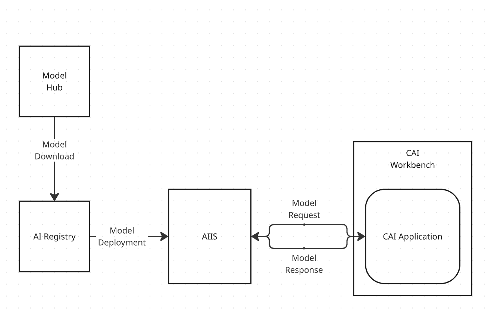
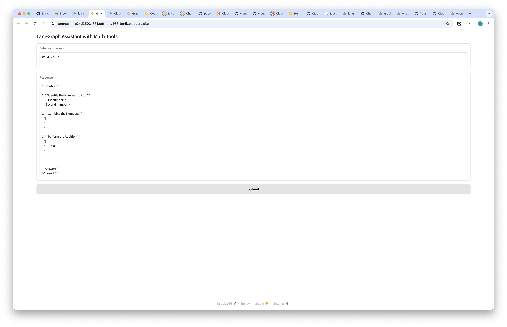

# How to Implement an Agentic AI Application in CAI with AI Inference Service and LangGraph

## Objective

In this tutorial you will learn how to deploy a simple Agentic AI Workflow in Cloudera AI leveraging Mixtral, the HuggingFace Catalog, LangGraph, and the Cloudera AI Inference Service programmatically using Python and an LLMOps Util.

First, you will download the model to the Cloudera AI Registry; Then, you will create an AI Inference Service Endpoint to serve predictions in real time from within your Data Center. Finally, you will deploy the Agentic AI LangGraph workflow as a CAI Application.



### Motivation

With Cloudera AI, enterprises can download open source GenAI models and securely host them in their Public or Private Cloud, in order to implement LLM-powered applications while preventing proprietary information from being shared with LLM Service Providers such as OpenAI.

### Cloudera AI & LLM's

Cloudera AI (CAI) is a platform that enables organizations to build, train, and deploy machine learning and artificial intelligence models at scale. One of its key features is the Cloudera AI Inference Service, which allows users to easily deploy large language models (LLMs) for real-time or batch inference. With Cloudera AI, data scientists and engineers can manage and serve LLMs like Llama, Mistral, or open-source GPT models using containerized environments and scalable infrastructure. This service supports secure, low-latency model serving, making it easier to integrate AI into enterprise applications.

### Hybrid Enterprise AI with CAI

Cloudera AI (CAI) is a core component of Cloudera’s hybrid cloud data platform, which is designed to operate seamlessly across both private and public cloud environments. This hybrid architecture allows organizations to deploy AI models securely wherever their data resides—on-premises for sensitive workloads or in the public cloud for greater scalability and flexibility. With Cloudera AI, enterprises can maintain governance, compliance, and control over their machine learning pipelines while taking advantage of cloud-native capabilities. This ensures that large language models and other AI applications can be deployed and managed securely across diverse IT environments without compromising performance or data privacy.

### CAI Integration with HuggingFace Catalog

CAI simplifies access to cutting-edge machine learning models through its integration with the Hugging Face Model Catalog, a popular repository for open-source models, including large language models (LLMs). This integration enables users to easily browse, select, and download pre-trained models directly from the Hugging Face Catalog into their Cloudera environment. Whether it's BERT, GPT, Llama, or other advanced models, Cloudera AI streamlines the process of importing and deploying them for inference or fine-tuning. This seamless connection accelerates experimentation and development while ensuring that models can be securely managed and deployed within Cloudera’s governed data platform.

## Requirements

This example was built with Cloudera On Cloud Public Cloud Runtime 7.3.1, CAI Workbench 2.0.50, Inference Service 1.4.0 and AI Registry 1.7.0.

The same example will also work in Private Cloud aside from having to use root certs in the httpx client class. For an example of this, check the way the client is instantiated in [llama-hf/model-deployment.ipynb](https://github.com/pdefusco/CAI_Inf_Service_Articles/blob/main/llama-hf/model-deployment.ipynb).  

You can reproduce this tutorial in your CAI environment with the following:

* A CAI Environment in Private or Public Cloud.
* An AI Registry deployment.
* An AI Inference Service deployment.
* The following ML Runtime should be available in your CAI Runtime Catalog and Project: ```pauldefusco/vscode4_cuda11_cml_runtime```
* You should have your CDP Workload User's Access Keys handy as you will need them to deploy the endpoint.

If you have an airgapped environment with Cloudera On Prem, you can still follow the steps shown in the the model deployment JupyterLab notebook as long as you have already completed the extra steps to download the model with the python script shown in the documentation: https://docs.cloudera.com/machine-learning/1.5.5/importing-model-airgapped/topics/ml-models-in-air-gapped-environment.html

## Useful Documentation Links

* How to deploy a Workbench in Cloudera AI: https://docs.cloudera.com/machine-learning/1.5.5/workspaces-privatecloud/topics/ml-pvc-provision-ml-workspace.html
* How to deploy an AI Registry in Cloudera AI: https://docs.cloudera.com/machine-learning/1.5.5/setup-model-registry/topics/ml-setting-up-model-registry.html
* How to deploy an AI Inference Service in Cloudera AI: https://docs.cloudera.com/machine-learning/1.5.5/setup-cloudera-ai-inference/topics/ml-caii-use-caii.html
* How to set up an NGC account:
* How to set up the CDP CLI: https://docs.cloudera.com/cdp-public-cloud/cloud/cli/topics/mc-cdp-cli.html

### Tutorial

All artifacts are included in this Git repository. You can clone or fork it as needed. https://github.com/pdefusco/CAI_Inf_Service_Articles.git

#### 1. Clone the Git Repository as a CAI Project

Create a project with the following entries:

```
Project Name: simple agent with AIIS and LangGraph
Project Description: Project to programmatically build AI Agent with AIIS, LangGraph and Mixtral from HF Catalog.
Initial Setup: -> GIT -> HTTPS -> https://github.com/pdefusco/CAI_Inf_Service_Articles.git
Runtimes:
  JupyterLab	Python 3.11	Standard	2025.06
  PBJ Workbench	Python 3.11	Standard	2025.06
```


#### 2. Create the Project Environment Variables with Secrets

Nearly all environment variables except the HuggingFace token will be set via the Navigate to User Settings -> Environment Variables and then save the following Environment Variables:

```
HF_TOKEN: Enter your HuggingFace token here
ENVIRONMENT_NAME: Enter CDP env name here e.g. pdf-jul-25-cdp-env
REGISTERED_MODEL_NAME: Enter model name as you'd like it to appear in AI Registry e.g. mixtral-8x7b-instruct
HF_REPO_ID: Enter Repo ID for model as it appears in HF Catalog e.g. mistralai/Mixtral-8x7B-Instruct-v0.1
ENDPOINT_NAME: Enter endpoint name as you'd like it to appear in AIIS e.g. mixtral-endpoint
RUNTIME_ID: Enter the CAI RUntime ID for the Agent App e.g. docker.repository.cloudera.com/cloudera/cdsw/ml-runtime-pbj-workbench-python3.10-standard:2025.06.1-b5
```


#### 3. Launch a CAI Session and Run the Script to Download the Model Programmatically

Launch your first CAI Session with PBJ Runtime. You won't need a lot of resources:

```
Kernel: Community Python 3.10 VSCode 2023.11 pauldefusco/vscode4_cuda11_cml_runtime
Resource Profile: 2 vCPU / 8 iGB Mem / 0 GPU
```


First, install the requirements by opening the Terminal and running this command:

```
pip3 install -r requirements.txt
```


Run ```llmopsApp.py``` to download Mixtral from HuggingFace to AI Registry and then deploy to an AI Inference Service endpoint. The script will automatically inherit the project environment variables you configured in step 2.

#### 4. Monitor Deployments from the UI

The llmops script will download the large language model from HuggingFace to the AI Registry, deploy it to AI Inference Service, and finally deploy the Agent App. You can monitor progress from the respective UI's.

#### 5. Interact with the Agent App

Open the Application and ask input basic questions such as ```What is 4+4?``` and validate the output.



## Summary & Next Steps

In this tutorial, we demonstrated how to programmatically download the LLaMA 3B–Instruct model from the Hugging Face Model Catalog and deploy it within the Cloudera AI ecosystem.

We walked through the steps to import the model into the Cloudera AI Registry, ensuring it is properly versioned and managed within a secure, governed environment. From there, we showed how to deploy the registered model to the Cloudera AI Inference Service, enabling scalable and low-latency serving of the LLM for downstream applications.

This end-to-end workflow highlights how Cloudera AI simplifies the process of operationalizing large language models using modern tools and integrated APIs.

**Additional Resources & Tutorials**
Explore these helpful tutorials and blogs to learn more about Cloudera AI, the AI Registry, and AI Inference Service:

1. **Cloudera AI Inference Service – Easy Integration & Deployment**
   A technical deep dive into how Cloudera’s inference service enables GenAI integration in production: ([Reddit][1], [Cloudera][2])

2. **Deploy & Scale AI Applications with Cloudera AI Inference Service**
   Official Cloudera blog covering general availability, hybrid support, and GPU acceleration: ([Cloudera][3])

3. **Cloudera Introduces AI Inference Service With NVIDIA NIM**
   Explains how NVIDIA NIM microservices are embedded, + details on AI Registry integration: ([Cloudera][4])

4. **Scaling AI Solutions with Cloudera: Inference & Solution Patterns**
   A deep technical walkthrough on deploying AI at scale, including RAG workflows with LLaMA models: ([Cloudera][5], [Reddit][6])

5. **How to Use Model Registry on Cloudera Machine Learning**
   Community guide focused specifically on registering, versioning, and managing models: ([community.cloudera.com][7])

6. **Cloudera AI Inference Service Overview (docs)**
   Official documentation outlining architecture, APIs (OpenAI & standard protocols), GPU support, and registry integration: ([Cloudera][2])

[1]: https://www.reddit.com/r/LlamaIndex/comments/1f4nqvc?utm_source=chatgpt.com "[Tutorial] Building Multi AI Agent System Using LlamaIndex and Crew AI!"
[2]: https://www.cloudera.com/blog/technical/cloudera-ai-inference-service-enables-easy-integration-and-deployment-of-genai.html?utm_source=chatgpt.com "Elevating Productivity: Cloudera Data Engineering Brings External IDE Connectivity to Apache Spark | Blog | Cloudera"
[3]: https://www.cloudera.com/blog/business/deploy-and-scale-ai-applications-with-cloudera-ai-inference-service.html?utm_source=chatgpt.com "Deploy and Scale AI Applications With Cloudera AI Inference Service | Blog | Cloudera"
[4]: https://cloudera.com/blog/business/cloudera-introduces-ai-inference-service-with-nvidia-nim.html?utm_source=chatgpt.com "Cloudera Introduces AI Inference Service With NVIDIA NIM | Blog | Cloudera"
[5]: https://www.cloudera.com/blog/technical/scaling-ai-solutions-with-cloudera-a-deep-dive-into-ai-inference-and-solution-patterns.html?utm_source=chatgpt.com "Scaling AI Solutions with Cloudera: A Deep Dive into AI Inference and Solution Patterns | Blog | Cloudera"
[6]: https://www.reddit.com/r/learnmachinelearning/comments/1cn1c3u?utm_source=chatgpt.com "Fine-tune your first large language model (LLM) with LoRA, llama.cpp, and KitOps in 5 easy steps"
[7]: https://community.cloudera.com/t5/Community-Articles/How-to-use-Model-Registry-on-Cloudera-Machine-Learning/ta-p/379812?utm_source=chatgpt.com "How to use Model Registry on Cloudera Machine Lear... - Cloudera Community - 379812"
