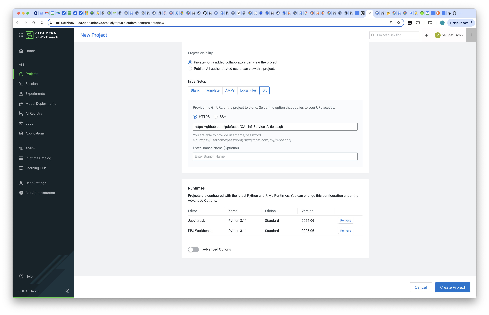
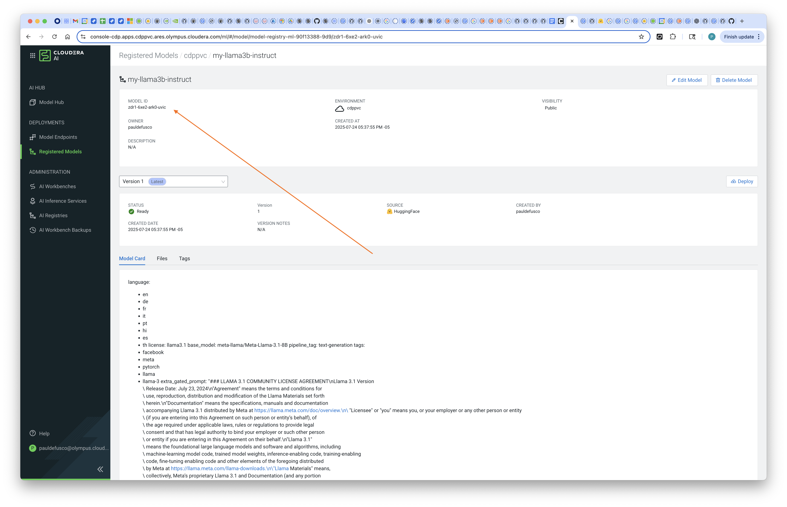

# Deploy Llama3b-Instruct to AI Inference Service from HF Catalog Programmatically

## Objective

In this tutorial you will learn how to programmatically deploy Meta's Llama-3.1-8B-Instruct LLM to the Cloudera AI Inference Service. First, you will download the model to the Cloudera AI Registry; Then, you will create an AI Inference Service Endpoint to serve predictions in real time from within your cluster.

### Cloudera AI & LLM's

Cloudera AI (CAI) is a platform that enables organizations to build, train, and deploy machine learning and artificial intelligence models at scale. One of its key features is the Cloudera AI Inference Service, which allows users to easily deploy large language models (LLMs) for real-time or batch inference. With Cloudera AI, data scientists and engineers can manage and serve LLMs like Llama, Mistral, or open-source GPT models using containerized environments and scalable infrastructure. This service supports secure, low-latency model serving, making it easier to integrate AI into enterprise applications.

### Hybrid Enterprise AI with CAI

Cloudera AI (CAI) is a core component of Cloudera’s hybrid cloud data platform, which is designed to operate seamlessly across both private and public cloud environments. This hybrid architecture allows organizations to deploy AI models securely wherever their data resides—on-premises for sensitive workloads or in the public cloud for greater scalability and flexibility. With Cloudera AI, enterprises can maintain governance, compliance, and control over their machine learning pipelines while taking advantage of cloud-native capabilities. This ensures that large language models and other AI applications can be deployed and managed securely across diverse IT environments without compromising performance or data privacy.

### CAI Integration with the Hugging Face Catalog

CAI simplifies access to cutting-edge machine learning models through its integration with the Hugging Face Model Catalog, a popular repository for open-source models, including large language models (LLMs). This integration enables users to easily browse, select, and download pre-trained models directly from the Hugging Face Catalog into their Cloudera environment. Whether it's BERT, GPT, Llama, or other advanced models, Cloudera AI streamlines the process of importing and deploying them for inference or fine-tuning. This seamless connection accelerates experimentation and development while ensuring that models can be securely managed and deployed within Cloudera’s governed data platform.

## Requirements

This example was built with Private Cloud 1.5.5 and CAI 2.0.49 but it will also work in Public Cloud without any changes. You can reproduce this tutorial in your CAI environment with the following:

* A HuggingFace Account and Token.
* A local installation of the CDP CLI.
* A CAI Environment in Private or Public Cloud.
* An AI Registry deployment.
* An AI Inference Service deployment.
* One Python 3.11 Cloudera AI Runtime with PBJ Workbench IDE and another one with JupyterLab.

The Private Cloud environment used for this example is not airgapped. For help with an airgapped environment please use the documentation at this link.

## Useful Documentation Links

* How to deploy a Workbench in Cloudera AI.
* How to deploy an AI Registry in Cloudera AI.
* How to deploy an AI Inference Service in Cloudera AI.
* How to set up a Hugging Face Account.
* How to set up the CDP CLI.

### Tutorial

All artifacts are included in this Git repository: https://github.com/pdefusco/CAI_Inf_Service_Articles.git

#### 1. Clone the Git Repository as a CAI Project

Create a project with the following entries:

```
Project Name: llama3b-instruct
Project Description: Project to programmatically download and deploy llama3b-instruct from HF Catalog.
Initial Setup: -> GIT -> HTTPS -> https://github.com/pdefusco/CAI_Inf_Service_Articles.git
Runtimes:
  JupyterLab	Python 3.11	Standard	2025.06
  PBJ Workbench	Python 3.11	Standard	2025.06
```





#### 2. Generate a CDP Token

In your local machine. Ensure that your ```~/.cdp/credentials``` file is configured for your CDP Workload User with appropriate keys.

Then, run the following command to generate a CDP Token. Notice that this has a TTL of one hour.

```
cdp --endpoint-url <your-cdp-console-endpoint> \
  --no-verify-tls \
  --form-factor private iam generate-workload-auth-token -\
  -workload-name DE
```


Temporarily save the token in a secure location on your personal machine.


#### 3. Create the Project Environment Variables with Secrets

Navigate to User Settings -> Environment Variables and then save the following Environment Variables:

```
CDP_TOKEN: <obtain-via-cdp-cli>
MODEL_REGISTRY_URL: <obtain-via-ai-registry-ui>
REPO_ID: meta-llama/Llama-3.1-8B-Instruct
HF_TOKEN: <your-hf-token-here>
```

* The CDP Token is generated via the CDP CLI command above.

* Obtain the Model Registry URL by finding the Domain Field in the AI Registry Menu:


* You can change the Repo ID if you want to deploy a different model. Otherwise, use the one provided above.

* The HF Token can be generated by logging into your account at https://huggingface.com

Your Environment Variables tab should look like this:


#### 4. Launch a CAI Session and Run the Script to Download the Model Programmatically

Launch your first CAI Session with PBJ Runtime. You won't need a lot of resources:

```
Kernel: Python 3.11 PBJ Workbench Standard
Resource Profile: 2 vCPU / 8 iGB Mem / 0 GPU
```


First, install the requirements by opening the Terminal and running this command:

```
pip3 install -r requirements.txt
```


At line 128, optionally modify the model name. This is the way your model will be tagged in the AI Registry once download starts.

Now run script ```model-deployment.py``` in your session.

Confirming that model download started successfully, the output on the right side of your screen should show something like this:

```
testpsingh (ID: 35th-3oq6-dysu-epyx)
testreg (ID: izd7-cdpr-08mr-vue5)
testreg1 (ID: mzmp-6put-ngps-wslk)
testreg11 (ID: nseg-86vj-vvjy-j1o8)
paul-llama-3b-instruct (ID: r6wo-dvxk-bg38-w80j)
paul-gpt2-test (ID: 8w8y-w7zw-6gau-tgp8)
paul-llama-3B-test (ID: dakh-e1bd-1sud-npyq)
CellTwrFail-CLF-pauldefusco (ID: 9psj-x9ra-bkr6-y40p)
sklearn_model (ID: 60kx-qct5-oafw-zztv)
CLF-pauldefusco (ID: gegj-4zwv-3fxm-woq7)
CLF-Two-pauldefusco (ID: 0hrg-0rsr-j6na-u69j)
CLF-Three-pauldefusco (ID: dsks-w5j3-3t65-7xwl)
CLF-Four-pauldefusco (ID: pyxq-r0ju-k6ts-vh2f)
CLF-Five-pauldefusco (ID: v511-pmsr-luti-b6su)
testadmin (ID: tl7a-tyet-8rqy-4kah)
✅ Model Created:
 {'created_at': '2025-07-24T22:37:55.876Z', 'creator': {'user_name': 'pauldefusco'}, 'id': 'zdr1-6xe2-ark0-uvic', 'model_versions': [{'created_at': '2025-07-24T22:37:55.878Z', 'metadata': {'model_repo_type': 'HF', 'tags': [{'key': 'repoId', 'value': 'meta-llama/Llama-3.1-8B-Instruct'}]}, 'model_id': 'zdr1-6xe2-ark0-uvic', 'model_name': 'my-llama3b-instruct', 'status': 'REGISTERING', 'tags': None, 'updated_at': '2025-07-24T22:37:55.878Z', 'user': {'user_name': 'pauldefusco'}, 'version': 1}], 'name': 'my-llama3b-instruct', 'tags': None, 'updated_at': '2025-07-24T22:37:55.876Z', 'visibility': 'public'}
```

#### 5. Monitor Model Download from the AI Registry UI

Come out of your project and open the Registered Model page. You should see an entry for your model. Click on it and validate that it is downloading from the HF Catalog.





#### 6. Deploy the Model Programmatically

Launch a new Session with JupyterLab. As before, you won't need a lot of resources:

```
Kernel: Python 3.11 JupyterLab Standard
Resource Profile: 2 vCPU / 8 iGB Mem / 0 GPU
```

Open the ```model-deployment.ipynb``` notebook.


## Summary & Next Steps

In this tutorial, we demonstrated how to programmatically download the LLaMA 3B–Instruct model from the Hugging Face Model Catalog and deploy it within the Cloudera AI ecosystem.

We walked through the steps to import the model into the Cloudera AI Registry, ensuring it is properly versioned and managed within a secure, governed environment. From there, we showed how to deploy the registered model to the Cloudera AI Inference Service, enabling scalable and low-latency serving of the LLM for downstream applications.

This end-to-end workflow highlights how Cloudera AI simplifies the process of operationalizing large language models using modern tools and integrated APIs.

**Additional Resources & Tutorials**
Explore these helpful tutorials and blogs to learn more about Cloudera AI, the AI Registry, and AI Inference Service:

1. **Cloudera AI Inference Service – Easy Integration & Deployment**
   A technical deep dive into how Cloudera’s inference service enables GenAI integration in production: ([Reddit][1], [Cloudera][2])

2. **Deploy & Scale AI Applications with Cloudera AI Inference Service**
   Official Cloudera blog covering general availability, hybrid support, and GPU acceleration: ([Cloudera][3])

3. **Cloudera Introduces AI Inference Service With NVIDIA NIM**
   Explains how NVIDIA NIM microservices are embedded, + details on AI Registry integration: ([Cloudera][4])

4. **Scaling AI Solutions with Cloudera: Inference & Solution Patterns**
   A deep technical walkthrough on deploying AI at scale, including RAG workflows with LLaMA models: ([Cloudera][5], [Reddit][6])

5. **How to Use Model Registry on Cloudera Machine Learning**
   Community guide focused specifically on registering, versioning, and managing models: ([community.cloudera.com][7])

6. **Cloudera AI Inference Service Overview (docs)**
   Official documentation outlining architecture, APIs (OpenAI & standard protocols), GPU support, and registry integration: ([Cloudera][2])

[1]: https://www.reddit.com/r/LlamaIndex/comments/1f4nqvc?utm_source=chatgpt.com "[Tutorial] Building Multi AI Agent System Using LlamaIndex and Crew AI!"
[2]: https://www.cloudera.com/blog/technical/cloudera-ai-inference-service-enables-easy-integration-and-deployment-of-genai.html?utm_source=chatgpt.com "Elevating Productivity: Cloudera Data Engineering Brings External IDE Connectivity to Apache Spark | Blog | Cloudera"
[3]: https://www.cloudera.com/blog/business/deploy-and-scale-ai-applications-with-cloudera-ai-inference-service.html?utm_source=chatgpt.com "Deploy and Scale AI Applications With Cloudera AI Inference Service | Blog | Cloudera"
[4]: https://cloudera.com/blog/business/cloudera-introduces-ai-inference-service-with-nvidia-nim.html?utm_source=chatgpt.com "Cloudera Introduces AI Inference Service With NVIDIA NIM | Blog | Cloudera"
[5]: https://www.cloudera.com/blog/technical/scaling-ai-solutions-with-cloudera-a-deep-dive-into-ai-inference-and-solution-patterns.html?utm_source=chatgpt.com "Scaling AI Solutions with Cloudera: A Deep Dive into AI Inference and Solution Patterns | Blog | Cloudera"
[6]: https://www.reddit.com/r/learnmachinelearning/comments/1cn1c3u?utm_source=chatgpt.com "Fine-tune your first large language model (LLM) with LoRA, llama.cpp, and KitOps in 5 easy steps"
[7]: https://community.cloudera.com/t5/Community-Articles/How-to-use-Model-Registry-on-Cloudera-Machine-Learning/ta-p/379812?utm_source=chatgpt.com "How to use Model Registry on Cloudera Machine Lear... - Cloudera Community - 379812"
