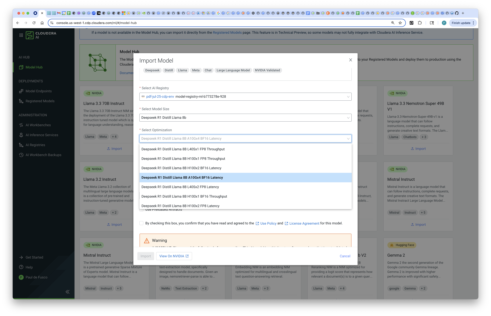
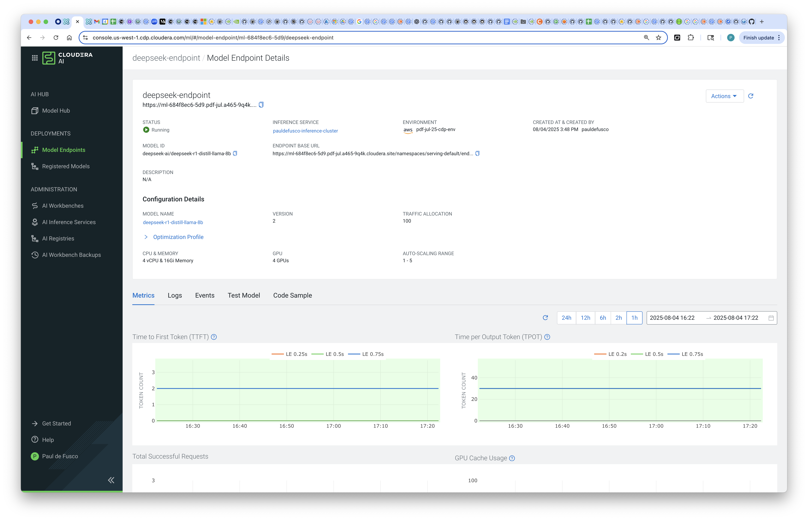
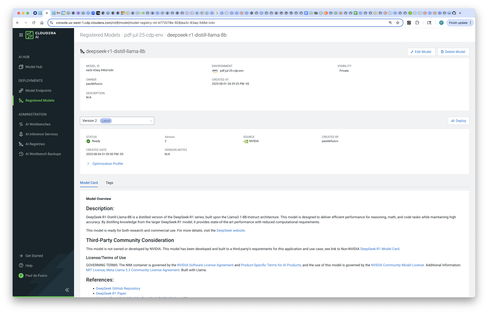
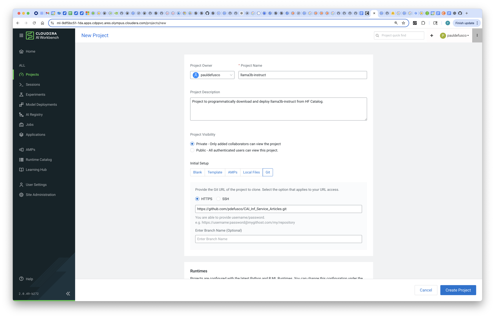
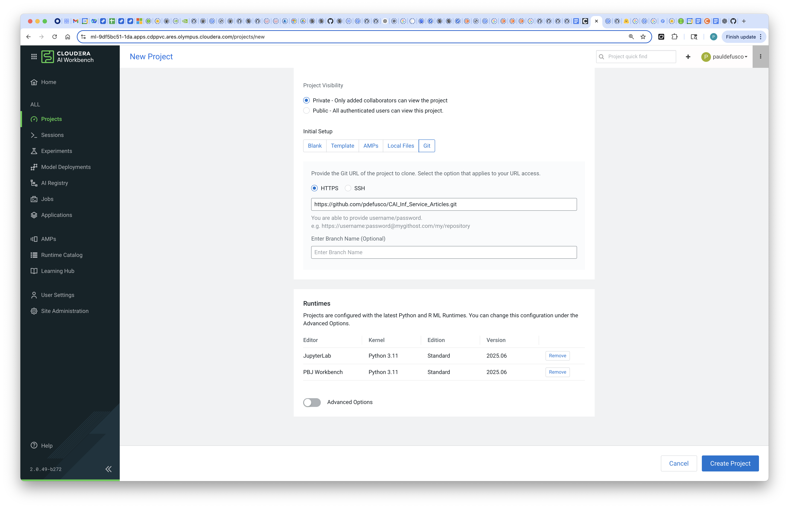

# LLMOps Utils for Cloudera AI Inference Service

## Objective

With Cloudera AI, enterprises can download open source GenAI models and securely host them in their Public or Private Cloud, in order to implement LLM-powered applications while preventing proprietary information from being shared with LLM Service Providers such as OpenAI.

In this tutorial you will learn how to programmatically deploy Deepseek R1 Distill Llama 8B to the Cloudera AI Inference Service programmatically using Python and an LLMOps Util.

First, you will download the model to the Cloudera AI Registry; Then, you will create an AI Inference Service Endpoint to serve predictions in real time from within your Data Center.

The LLMOps util and the overall tutorial is particularly tailored for CAI users who want to complete the end to end lifecycle - from LLM download to Endpoint - entirely in Python. If you'd like to use a different model you can apply the same steps for any language models available in the NGC Catalog.  

### Cloudera AI & LLM's

Cloudera AI (CAI) is a platform that enables organizations to build, train, and deploy machine learning and artificial intelligence models at scale. One of its key features is the Cloudera AI Inference Service, which allows users to easily deploy large language models (LLMs) for real-time or batch inference. With Cloudera AI, data scientists and engineers can manage and serve LLMs like Llama, Mistral, or open-source GPT models using containerized environments and scalable infrastructure. This service supports secure, low-latency model serving, making it easier to integrate AI into enterprise applications.

### Hybrid Enterprise AI with CAI

Cloudera AI (CAI) is a core component of Cloudera’s hybrid cloud data platform, which is designed to operate seamlessly across both private and public cloud environments. This hybrid architecture allows organizations to deploy AI models securely wherever their data resides—on-premises for sensitive workloads or in the public cloud for greater scalability and flexibility. With Cloudera AI, enterprises can maintain governance, compliance, and control over their machine learning pipelines while taking advantage of cloud-native capabilities. This ensures that large language models and other AI applications can be deployed and managed securely across diverse IT environments without compromising performance or data privacy.

### CAI Integration with NGC


## Requirements

This example was built with Cloudera On Cloud Public Cloud Runtime 7.3.1, CAI Workbench 2.0.50, Inference Service 1.4.0 and AI Registry 1.7.0. The same example will also work in Private Cloud without any changes. You can reproduce this tutorial in your CAI environment with the following:

* A local installation of the CDP CLI.
* A CAI Environment in Private or Public Cloud.
* An AI Registry deployment.
* An AI Inference Service deployment.
* The folloing ML Runtime should be available in your CAI Runtime Catalog and Project: ```pauldefusco/vscode4_cuda11_cml_runtime```
* You should have your CDP Workload User's Access Keys handy as you will need them to deploy the endpoint.

If you have an airgapped environment with Cloudera On Prem, you can still follow the steps shown in the the model deployment JupyterLab notebook as long as you have already completed the extra steps to download the model with the python script shown in the documentation: https://docs.cloudera.com/machine-learning/1.5.5/importing-model-airgapped/topics/ml-models-in-air-gapped-environment.html

## Useful Documentation Links

* How to deploy a Workbench in Cloudera AI: https://docs.cloudera.com/machine-learning/1.5.5/workspaces-privatecloud/topics/ml-pvc-provision-ml-workspace.html
* How to deploy an AI Registry in Cloudera AI: https://docs.cloudera.com/machine-learning/1.5.5/setup-model-registry/topics/ml-setting-up-model-registry.html
* How to deploy an AI Inference Service in Cloudera AI: https://docs.cloudera.com/machine-learning/1.5.5/setup-cloudera-ai-inference/topics/ml-caii-use-caii.html
* How to set up an NGC account:
* How to set up the CDP CLI: https://docs.cloudera.com/cdp-public-cloud/cloud/cli/topics/mc-cdp-cli.html

### Tutorial

All artifacts are included in this Git repository. You can clone or fork it as needed. https://github.com/pdefusco/CAI_Inf_Service_Articles.git

#### 1. Download Deepseek via Cloudera AI Model Hub

Navigate to the Model Hub UI. Import the model via the UI and wait for the download to complete.

You can check for progress in the AI Registry via the "Registered Models" UI.







#### 2. Clone the Git Repository as a CAI Project

Create a project with the following entries:

```
Project Name: Deepseek Deployment
Project Description: Project to programmatically deploy deepseek model to AI Registry Endpoint.
Initial Setup: -> GIT -> HTTPS -> https://github.com/pdefusco/CAI_Inf_Service_Articles.git
Runtimes:
  JupyterLab	Python 3.11	Standard	2025.06
  PBJ Workbench	Python 3.11	Standard	2025.06
```





#### 3. Launch Session and Install Requirements

Launch a CAI Session with the VSCode runtime. Then run the following command in the Session terminal in order to install  project dependencies. If this is your first time using the runtime, you may have to install a Python plugin.

```
pip3 install -r requirements.txt
```

#### 4. Run the Llmops App

In the CAI Session, run the code. Enter your CDP User Management Access Keys when prompted. In the prompt, validate that model deployment has launched, and navigate to the Model Endpoints UI to check on progress.

Here are some of the most useful utils explained:

Use the ```configure_cdp``` method to set CDP Access Key ID and Private Key.

```
def configure_cdp(variable, value):
    command = ["cdp", "configure", "set", variable, value]
    result = subprocess.run(command, capture_output=True, text=True)

    if result.returncode != 0:
        print("cdp command failed.")
        print("Error:")
        print(result.stderr)
    return None
print("CDP config function defined!")
```

Use ```get_ums_jwt_token``` to retrieve your CDP Token. CDP Access Keys are automatically read after using ```configure_cdp```.

```
def get_ums_jwt_token():
    command = ["cdp", "iam", "generate-workload-auth-token",
               "--workload-name", "DE"]
    result = subprocess.run(command, capture_output=True, text=True)

    if result.returncode != 0:
        print("cdp command failed.")
        print("Error:")
        print(result.stderr)
        return None

    try:
        return json.loads(result.stdout)['token']
    except (json.JSONDecodeError, KeyError) as e:
        print(f"Error: {e}")
        return None

        print("Defined function to get CDP_TOKEN!")
```

Use ```get_registry_endpoint``` to retrieve the Domain URL for the AI Registry associated with your CDP Environment.

```
def get_registry_endpoint(environmentName):
    command = ["cdp", "ml", "list-model-registries"]
    result = subprocess.run(command, capture_output=True, text=True)

    if result.returncode != 0:
        print("cdp command failed.")
        print("Error:")
        print(result.stderr)
        return None
    try:
        registries = json.loads(result.stdout)['modelRegistries']
        for registry in registries:
            if registry['environmentName'] == environmentName:
                return registry['domain']
                #return json.loads(result.stdout)['modelRegistries'][0]['domain']
    except (json.JSONDecodeError, KeyError) as e:
        print(f"Error: {e}")
        return None
```

Use ```get_caii_domain``` to retrieve the Domain URL for the AI Inference Service associated with your CDP Environment.

```
def get_caii_domain(environmentName):
    command = ["cdp", "ml", "list-ml-serving-apps"]
    result = subprocess.run(command, capture_output=True, text=True)

    if result.returncode != 0:
        print("cdp command failed.")
        print("Error:")
        print(result.stderr)
        return None

    try:
        aiisApps = json.loads(result.stdout)['apps']
        for app in aiisApps:
            if app['environmentName'] == environmentName:
                return app['cluster']['domainName']
        #return json.loads(result.stdout)['apps'][1]['cluster']['domainName']
    except (json.JSONDecodeError, KeyError) as e:
        print(f"Error: {e}")
        return None
```

Use ```deploy_model_to_caii``` to deploy a Model Endpoint to AI Infernece Service from the AI Registry. Notice you can further customize this method by parameterizing fields such as ```instance_type``` and ```resources```.

```
def deploy_model_to_caii(caii_domain, cdp_token, model_id, model_version, endpoint_name):
    # construct url
    deploy_url = f"https://{caii_domain}/api/v1alpha1/deployEndpoint"

    headers = {'Authorization': 'Bearer ' + cdp_token,
           'Content-Type': 'application/json'}

    client = httpx.Client(headers=headers)

    deploy_payload = {
        "namespace": "serving-default",
        "name": f"{endpoint_name}",
        "instance_type": "g5.12xlarge",
        "task": "INFERENCE",
        "source": {
            "registry_source": {
                "model_id": f"{model_id}",
                "version": f"{model_version}"
            }
        },
        "resources": {
            "req_cpu": "4",
            "req_memory": "16Gi",
            "num_gpus": "4"
        },
        "autoscaling": {
            "min_replicas": "1",
            "max_replicas": "5"
        }
    }
    try:
        response = client.post(deploy_url, json=deploy_payload)
        response.raise_for_status()
        print(f"Deployed {endpoint_name} successfully!")
    except httpx.HTTPStatusError as e:
        print(f"HTTP {e.response.status_code}: {e.response.text}")
    except httpx.RequestError as e:
        print(f"Error deploying {endpoint_name}: {e}")
```

Use ```endpoint_is_ready``` to validate that a model endpoint has deployed successfully.

```
def endpoint_is_ready(caii_domain, cdp_token, endpoint_name):
    headers = {'Authorization': 'Bearer ' + cdp_token,
           'Content-Type': 'application/json'}
    url = f"https://{caii_domain}/api/v1alpha1/describeEndpoint"
    payload = {"namespace": "serving-default", "name": f"{endpoint_name}"}

    client = httpx.Client(headers=headers)

    try:
        response = client.post(url, json=payload)
        response.raise_for_status()
        return response.json()['status']['active_model_state'] == 'Loaded'
    except httpx.HTTPStatusError as e:
        print(f"HTTP {e.response.status_code}: {e.response.text}")
    except httpx.RequestError as e:
        print(f"Error describing {endpoint_name}: {e}")
```

Use ```get_endpoint_base_url``` to retrieve an endpoint URL once deployment has completed.

```
def get_endpoint_base_url(caii_domain, cdp_token, endpoint_name):
    headers = {'Authorization': 'Bearer ' + cdp_token,
           'Content-Type': 'application/json'}
    url = f"https://{caii_domain}/api/v1alpha1/describeEndpoint"
    payload = {"namespace": "serving-default", "name": f"{endpoint_name}"}

    client = httpx.Client(headers=headers)

    try:
        response = client.post(url, json=payload)
        response.raise_for_status()
        return base_url(response.json()['url'], endpoint_name)
    except httpx.HTTPStatusError as e:
        print(f"HTTP {e.response.status_code}: {e.response.text}")
    except httpx.RequestError as e:
        print(f"Error describing {endpoint_name}: {e}")
```

See additional methods in ```llmopsUtils/llmopsUtils.py```.

## Summary & Next Steps

In this tutorial, we demonstrated how to programmatically download the LLaMA 3B–Instruct model from the Hugging Face Model Catalog and deploy it within the Cloudera AI ecosystem.

We walked through the steps to import the model into the Cloudera AI Registry, ensuring it is properly versioned and managed within a secure, governed environment. From there, we showed how to deploy the registered model to the Cloudera AI Inference Service, enabling scalable and low-latency serving of the LLM for downstream applications.

This end-to-end workflow highlights how Cloudera AI simplifies the process of operationalizing large language models using modern tools and integrated APIs.

**Additional Resources & Tutorials**
Explore these helpful tutorials and blogs to learn more about Cloudera AI, the AI Registry, and AI Inference Service:

1. **Deploy Llama 3.1 8B Instruct to AI Inference Service from HF Catalog Programmatically**
   An end to end workflow including programmatic download of Llama 3.1 8B Instruct, deployment and inference: ([Cloudera][1])

2. **Deploy & Scale AI Applications with Cloudera AI Inference Service**
   Official Cloudera blog covering general availability, hybrid support, and GPU acceleration: ([Cloudera][2])

3. **Cloudera Introduces AI Inference Service With NVIDIA NIM**
   Explains how NVIDIA NIM microservices are embedded, + details on AI Registry integration: ([Cloudera][3])

4. **Scaling AI Solutions with Cloudera: Inference & Solution Patterns**
   A deep technical walkthrough on deploying AI at scale, including RAG workflows with LLaMA models: ([Cloudera][4], [Reddit][5])

5. **How to Use Model Registry on Cloudera Machine Learning**
   Community guide focused specifically on registering, versioning, and managing models: ([community.cloudera.com][6])

6. **Cloudera AI Inference Service Overview (docs)**
   Official documentation outlining architecture, APIs (OpenAI & standard protocols), GPU support, and registry integration: ([Cloudera][7])

[1]: https://github.com/pdefusco/CAI_Inf_Service_Articles/tree/main/llama-hf "[Tutorial] Deploy Llama 3.1 8B Instruct to AI Inference Service from HF Catalog Programmatically"
[2]: https://www.cloudera.com/blog/business/deploy-and-scale-ai-applications-with-cloudera-ai-inference-service.html?utm_source=chatgpt.com "Deploy and Scale AI Applications With Cloudera AI Inference Service | Blog | Cloudera"
[3]: https://cloudera.com/blog/business/cloudera-introduces-ai-inference-service-with-nvidia-nim.html?utm_source=chatgpt.com "Cloudera Introduces AI Inference Service With NVIDIA NIM | Blog | Cloudera"
[4]: https://www.cloudera.com/blog/technical/scaling-ai-solutions-with-cloudera-a-deep-dive-into-ai-inference-and-solution-patterns.html?utm_source=chatgpt.com "Scaling AI Solutions with Cloudera: A Deep Dive into AI Inference and Solution Patterns | Blog | Cloudera"
[5]: https://www.reddit.com/r/learnmachinelearning/comments/1cn1c3u?utm_source=chatgpt.com "Fine-tune your first large language model (LLM) with LoRA, llama.cpp, and KitOps in 5 easy steps"
[6]: https://community.cloudera.com/t5/Community-Articles/How-to-use-Model-Registry-on-Cloudera-Machine-Learning/ta-p/379812?utm_source=chatgpt.com "How to use Model Registry on Cloudera Machine Lear... - Cloudera Community - 379812"
