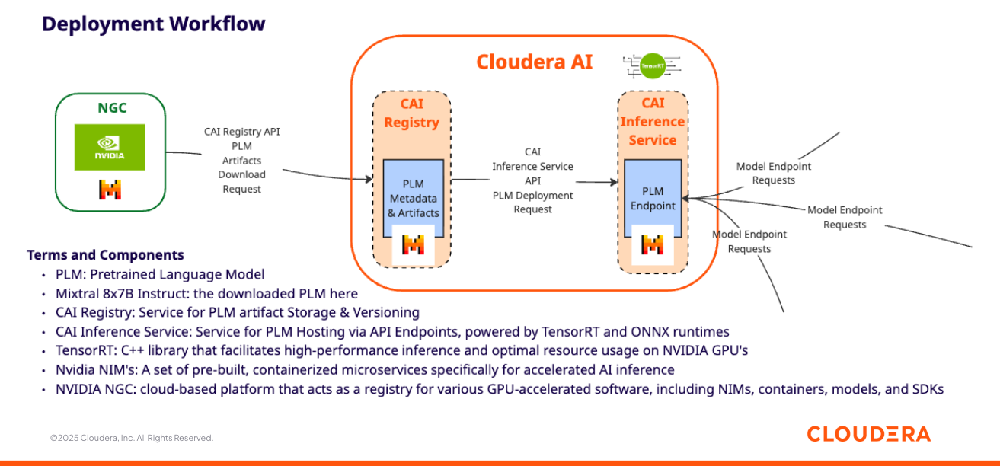
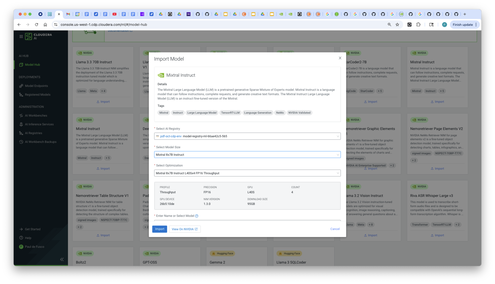
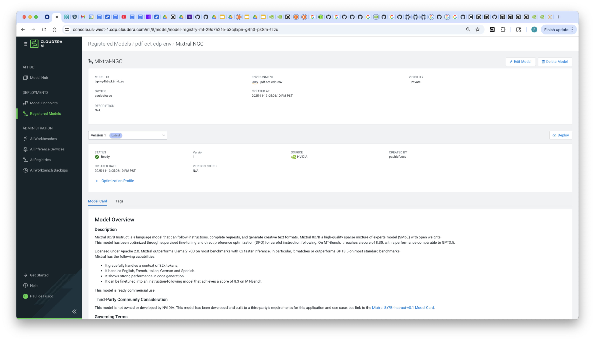
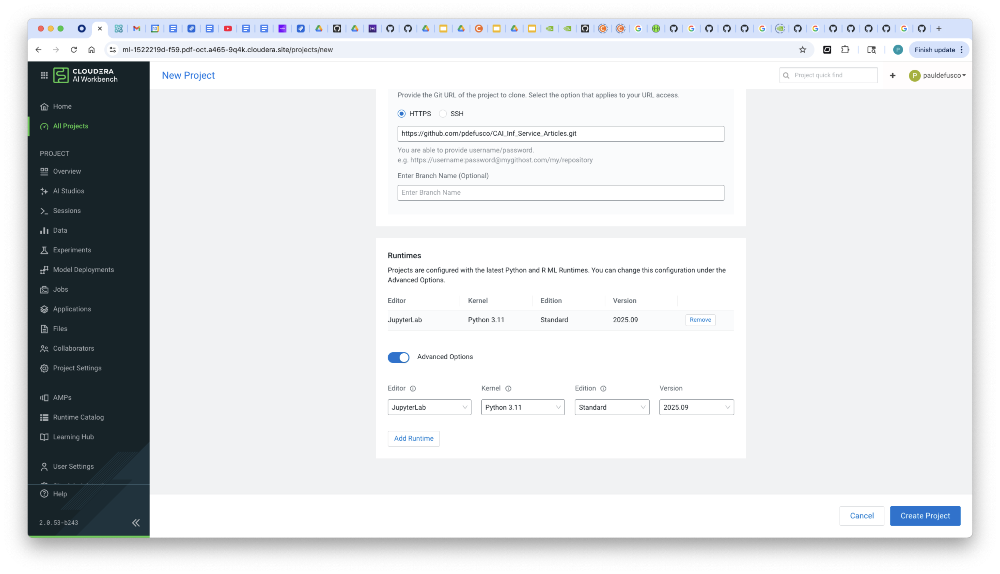
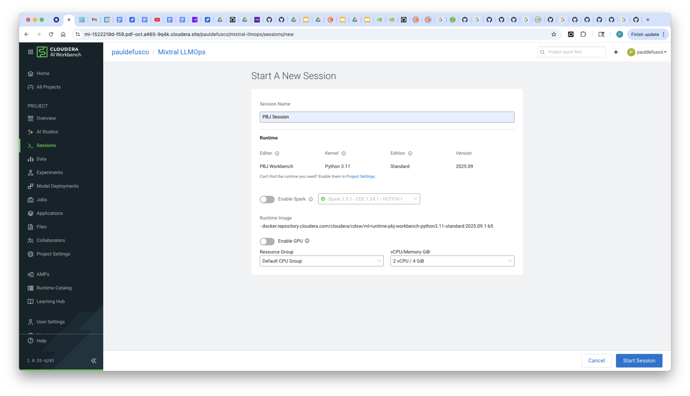
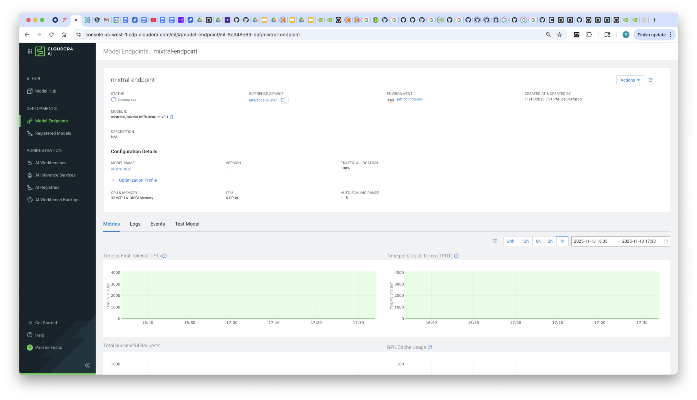
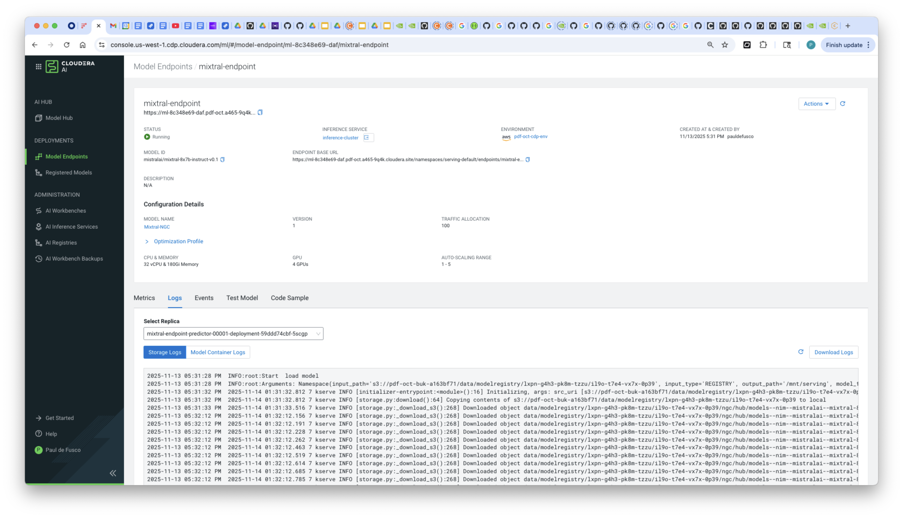

# Deploy Mixtral 8x7B Instruct from NGC Catalog to AI Inference Service



## Objective

In this tutorial you will learn how to programmatically deploy Mixtral 8x7B Instruct to the Cloudera AI Inference Service. First, you will download the model to the Cloudera AI Registry; Then, you will create an AI Inference Service Endpoint to serve predictions in real time from within your Public Cloud of choice.

If you'd like to use a different model you can apply the same steps for other language models available in the NGC Catalog.  

### Motivation

Mixtral is a family of large‐language models built on a sparse mixture-of-experts (MoE) architecture developed by Mistral AI. It’s based on the same basic architecture as Mistral 7B, but each layer has multiple “expert” feed-forward sub-blocks (for example 8 experts) and a router that selects which expert(s) to use for each token.

“Mixtral Instruct” is a fine-tuned variant of the base Mixtral model that has been adapted to follow instructions, prompts, then respond in a more controlled interactive manner, a great fit for chatbot, Q&A, and summarization use cases. It has gained a lot of popularity because it delivers performance while remaining lightweight enough to run on generally more limited hardware resources than other large language models.

With Cloudera AI, enterprises can download open source GenAI models such as Mixtral 8×7B Instruct (or others) and securely host them in their Public or Private Cloud, thus implementing their own LLM-powered applications while preventing proprietary information from being shared with closed-source model services such as OpenAI.

### Cloudera AI & LLM's

Cloudera AI (CAI) is a platform that enables organizations to build, train, and deploy machine learning and artificial intelligence models at scale. One of its key features is the Cloudera AI Inference Service, which allows users to easily deploy large language models (LLMs) for real-time or batch inference. With Cloudera AI, data scientists and engineers can manage and serve LLMs like Llama, Mistral, or open-source GPT models using containerized environments and scalable infrastructure. This service supports secure, low-latency model serving, making it easier to integrate AI into enterprise applications.

### Hybrid Enterprise AI with CAI

Cloudera AI (CAI) is a core component of Cloudera’s hybrid cloud data platform, which is designed to operate seamlessly across both private and public cloud environments. This hybrid architecture allows organizations to deploy AI models securely wherever their data resides—on-premises for sensitive workloads or in the public cloud for greater scalability and flexibility. With Cloudera AI, enterprises can maintain governance, compliance, and control over their machine learning pipelines while taking advantage of cloud-native capabilities. This ensures that large language models and other AI applications can be deployed and managed securely across diverse IT environments without compromising performance or data privacy.

### CAI Integration with the NGC Catalog

NVIDIA NGC is a curated catalog and registry of GPU-optimized containers, pretrained models, SDKs, and full AI/HPC workflows from NVIDIA, designed to help users quickly build, train, and deploy AI workloads across cloud, on-premises, and edge environments.

Cloudera AI Registry (part of Cloudera’s model management offering) integrates with NGC so that models from the NGC catalog can be imported directly into the Registry—enabling enterprises to govern, deploy, and monitor NVIDIA-optimized models within their existing Cloudera AI workflows.

Cloudera AI features a Model Hub which provides a UI driven mechanism for downloading models from NGC to the Cloudera AI Registry, as well as additional information and links to model cards in NGC. For example, more information on the model used in this example - Mixtral 8x7B - can be found at this link: https://catalog.ngc.nvidia.com/orgs/nim/teams/mistralai/containers/mixtral-8x7b-instruct-v01?version=1.8.4

## Requirements

This example was built with Cloudera On Cloud Public Cloud 7.3.1, CAI Workbench 2.0.53, Inference Service 1.7.0 and AI Registry 1.11.0. The same example will also work in Private Cloud without any changes. You can reproduce this tutorial in your CAI environment with the following:

* A CAI Environment in Private or Public Cloud.
* An AI Registry deployment.
* An AI Inference Service deployment with g6e.12xlarge GPU node group / Autoscale Range Min Max 1-4 / Root Volume Size 512.
* A Python 3.11 Cloudera AI Runtime with JupyterLab Workbench IDE.

If you are operating in a Cloudera On Prem environment that is airgapped you have to follow a few extra steps to download the model with a python script shown as documented here: https://docs.cloudera.com/machine-learning/1.5.5/importing-model-airgapped/topics/ml-models-in-air-gapped-environment.html

## Useful Documentation Links

* How to deploy a Workbench in Cloudera AI: https://docs.cloudera.com/machine-learning/1.5.5/workspaces-privatecloud/topics/ml-pvc-provision-ml-workspace.html
* How to deploy an AI Registry in Cloudera AI: https://docs.cloudera.com/machine-learning/1.5.5/setup-model-registry/topics/ml-setting-up-model-registry.html
* How to deploy an AI Inference Service in Cloudera AI: https://docs.cloudera.com/machine-learning/1.5.5/setup-cloudera-ai-inference/topics/ml-caii-use-caii.html

### Tutorial

All artifacts are included in this Git repository. You can clone or fork it as needed. https://github.com/pdefusco/CAI_Inf_Service_Articles.git

#### 1. Download the Model from NGC to AI Registry via the Cloudera Model Hub






#### 2. Deploy the Model to AI Inference Service

Create a CAI Project and ensure to add the Python 3.11 Cloudera AI Runtime with JupyterLab IDE.




Launch a CAI Session and install the requirements with ```pip install mixtral-ngc/requirements.txt```.




Run through the notebook and execute each cell. You will need to enter your CDP User credentials - Access Key ID and Private Key - which you can obtain from the User Management page in the Management Console.

Finally, navigate to the Inference Service Model Deployments tab and validate that the endpoint has deployed.





## Summary & Next Steps

In this tutorial, we demonstrated how to download Mixtral 8x7B Instruct from the Nvidia NGC Catalog and deploy it within the Cloudera AI ecosystem.

This end-to-end workflow highlights how Cloudera AI simplifies the process of operationalizing large language models using modern tools and integrated APIs.

You can replicate this pattern in your On Prem Data Center or Public Cloud VPC in order to privately host a Mixtral 8×7B Instruct model for llm-powered enterprise applications.  

**Additional Resources & Tutorials**
Explore these helpful tutorials and blogs to learn more about Cloudera AI, the AI Registry, and AI Inference Service:

1. **Cloudera AI Inference Service – Easy Integration & Deployment**
   A technical deep dive into how Cloudera’s inference service enables GenAI integration in production: ([Reddit][1], [Cloudera][2])

2. **Deploy & Scale AI Applications with Cloudera AI Inference Service**
   Official Cloudera blog covering general availability, hybrid support, and GPU acceleration: ([Cloudera][3])

3. **Cloudera Introduces AI Inference Service With NVIDIA NIM**
   Explains how NVIDIA NIM microservices are embedded, + details on AI Registry integration: ([Cloudera][4])

4. **Scaling AI Solutions with Cloudera: Inference & Solution Patterns**
   A deep technical walkthrough on deploying AI at scale, including RAG workflows with LLaMA models: ([Cloudera][5], [Reddit][6])

5. **How to Use Model Registry on Cloudera Machine Learning**
   Community guide focused specifically on registering, versioning, and managing models: ([community.cloudera.com][7])

6. **Cloudera AI Inference Service Overview (docs)**
   Official documentation outlining architecture, APIs (OpenAI & standard protocols), GPU support, and registry integration: ([Cloudera][2])

[1]: https://www.reddit.com/r/LlamaIndex/comments/1f4nqvc?utm_source=chatgpt.com "[Tutorial] Building Multi AI Agent System Using LlamaIndex and Crew AI!"
[2]: https://www.cloudera.com/blog/technical/cloudera-ai-inference-service-enables-easy-integration-and-deployment-of-genai.html?utm_source=chatgpt.com "Elevating Productivity: Cloudera Data Engineering Brings External IDE Connectivity to Apache Spark | Blog | Cloudera"
[3]: https://www.cloudera.com/blog/business/deploy-and-scale-ai-applications-with-cloudera-ai-inference-service.html?utm_source=chatgpt.com "Deploy and Scale AI Applications With Cloudera AI Inference Service | Blog | Cloudera"
[4]: https://cloudera.com/blog/business/cloudera-introduces-ai-inference-service-with-nvidia-nim.html?utm_source=chatgpt.com "Cloudera Introduces AI Inference Service With NVIDIA NIM | Blog | Cloudera"
[5]: https://www.cloudera.com/blog/technical/scaling-ai-solutions-with-cloudera-a-deep-dive-into-ai-inference-and-solution-patterns.html?utm_source=chatgpt.com "Scaling AI Solutions with Cloudera: A Deep Dive into AI Inference and Solution Patterns | Blog | Cloudera"
[6]: https://www.reddit.com/r/learnmachinelearning/comments/1cn1c3u?utm_source=chatgpt.com "Fine-tune your first large language model (LLM) with LoRA, llama.cpp, and KitOps in 5 easy steps"
[7]: https://community.cloudera.com/t5/Community-Articles/How-to-use-Model-Registry-on-Cloudera-Machine-Learning/ta-p/379812?utm_source=chatgpt.com "How to use Model Registry on Cloudera Machine Lear... - Cloudera Community - 379812"
